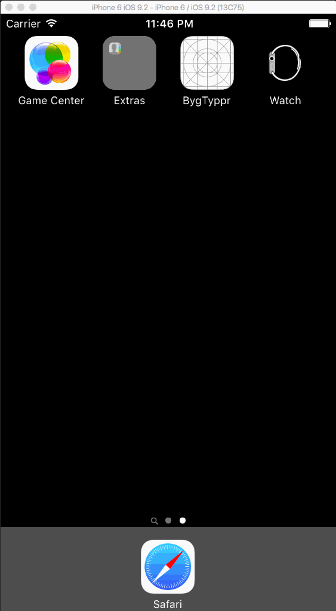

# BygTyppr

This is a Tip Calculator application for iOS submitted as the [pre-assignment](https://gist.github.com/timothy1ee/7747214) requirement for Codepath.

Time spent: 16 hours  

Completed:

*  Required: User can enter a bill amount, choose a tip percentage, and see the tip and total values.
*  Required: Settings page to change the default tip percentage.
* Optional: UI animations
* Additional: keyboard is dismissed through text delegate
* Additional: pan gesture recognize to create "dial" for thumbing the percentage amount
* Additional:  default tip percentages persist after dismissing the app

Notes:

App is laid out for iPhone 6 portrait. 

A few extensions, snippets were used from Stack Overflow, citations are in the source. 

GIF created with [LiceCap](http://www.cockos.com/licecap/).